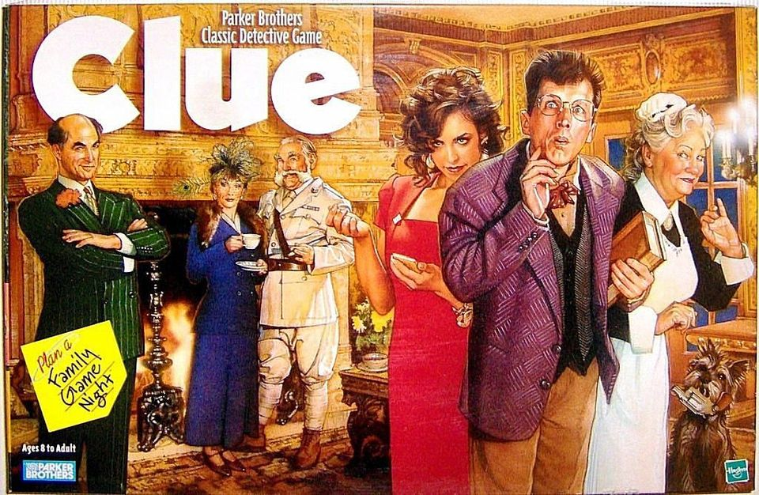

# Objects & Arrays

## Property Access

Assignments with Dots

```js
var person = {}; // declare a person object

person.name = "Mrs. White"; // assign a value to a property

var person = { // object literal notation
    "name": "Mrs. White" // the quotation marks are not needed for a one-word property declaration, JavaScript will assume it is a string
};
```

**Anything that ever uses a dot in JavaScript is an object.**

```js
var person = {};

person.name = "Mrs. White";

var who = person.name;

who; //??

person.name = "Mr. White";

who; //??

who.story //??
```

A primitive value is a string, number, boolean, null, or undefined. A non-primitive value is an object, array, function, promise. Primitive values get passed by value, non-primitive values get passed by reference. If you are passing primitive values, a copy is made, non-primitive values are passed as a reference. This behavior can produce unpredictable results if you are not careful. For example, if you were to assign person.name to a variable i.e. who, then reassign person.name, who would retain the original reference for person.name.

## Arrays

```js
var person = [];

person.name = "Mrs. White";

var who = person.name;

who; //??

typeof person === "array"; //??
```

Arrays are objects, and because of that, the rules are exactly the same. The major difference between an array and an object are the available methods for either, an example of which is .length being an available method for arrays, but not objects. If you check the typeof for the person variable in the code block above, the console should return object.

## Bracket Notation

```js
var person = [];

person.name = "Mrs. White";

var who = person.name;

person[0] = "I was not in the Billiards room";
```

```js
var person = []; // declare a person array
var plea = "wouldShe"

person.name = "Mrs. White"; // assign a vaule to a property

person[plea] = "I would never!"
```

The person[plea] = "I would never!" will create a new property in the person array based on the original value of the plea variable "wouldShe", which will make the person array look like this:

```js
person = [
  name: "Mrs. White",
  wouldShe: "I would never!"
]
```

If the intention was to create a plea key for the person object, then you need to surround the plea with quotes. i.e. person["plea"] = "I would never!". The person array would then look like this:

```js
person = [
  name: "Mrs. White",
  plea: "I would never!"
]
```

Reviewing what we’ve learned about objects and arrays:

- An array is an object that has methods available to it.
- A property string can be passed with dot notation or brackets and quotes.
- Dot notation coerces to a string, but cannot coerce a number to a string, it will result in a SyntaxError. JavaScript will start to evaluate the number as a number and then throw the SyntaxError.
- If you receive a SyntaxError when trying to access a variable within an object with dot notation, use bracket notation and quotes around the variable name to access it.

## Non-Valid Characters

Try not to use non-valid characters as property names, like '^&*', that is not a very good property name both because it uses non-valid characters and it is not named in a very memorable or sensible way. You can certainly use non-valid characters to name your properties, but the name will need to be surrounded by quotes. Try to keep your code to the point and don’t get too fancy.

```js
var box = {};

box['material'] = 'cardboard';
box[0] = 'meow';
box['^&*'] = "testing 123";

var test = box['^&*'];

box = {
  "material": 'cardboard',
  "0": 'meow',
  '^&*': "testing 123"
}
```

### Q&A

Q: What is the difference between an array and an object? (this seems to have already been answered in the previous section)

A: An array is a special kind of object. The most special thing about an array is the .length property which is a property that is computed as you add numerical indices. Numerical indices are different than properties on an array because an array captures that and will increment the length.

If you have an array containing any number of items and add something to an index that does not exist; if you add something to the array at an index position that is more than 1 greater than the current .length [numnber of index positions] of the array, empty values will be inserted until it reaches the requested index position. i.e. original array is `y=[0,1,2,3,4,5]` and you would like to add `y[10]=number`, the array will now be `[0,1,2,3,4,5,,,,number]`

**Arrays are easier to reverse and loop through than objects.**

## Game Characters Challenge

Exercise: Create an object using bracket and dot notation that represents the characters and related data you may find in a game of Clue.



Characters Weapons Rooms

```js
var clue = {
    characters: ['Professor Plum', 'Miss Scarlet', 'Mrs. Peacock', 'Mr. Boddy', 'Mrs. White', 'Colonel Mustard', 'The Singing Telegram Girl', 'The Motorist', 'Mr. Green'],
    weapons: ['candlestick', 'dagger', 'lead pipe', 'revolver', 'rope', 'spanner'],
    rooms: ['dining room', 'kitchen', 'study', 'billiard room', 'sunroom', 'ballroom']
}
```

## Game Characters Solution

```js
var game = {};

game.murderer = "??";

game['weapons'] = ['lasers', 'angry cats', 'dish soap'];
// why would you choose an array vs an object? If you have a list of something that is all falling under the same category, an array makes more sense vs an object
```

If you took the above array and made it into an object, it might look something like this:

```js
game['weapons'] = [ // an object(s) 'key' should be the same for each 'value', so that it is predictable.
    {type: 'lasers', location: 'lab'},
    {type: 'angry cats', location: 'dining room'},
    {type: 'dish soap', location: 'sunroom'}
]

game.name = [];

game.name[0] = 'Miss Scarlet';
game.name.push('Mr. Green');
```
