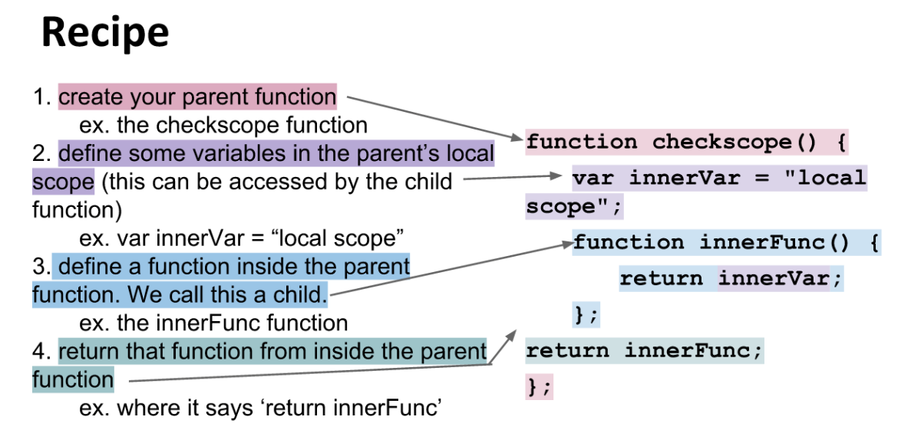

# Advanced Scope: Closure

## Closure

```js
const myAlert = () => {
  // declare a function
  const x = 'Help! I think I found a clue!'; // save a string to the constant x
  const alerter = () => {
    // declare another function
    alert(x); // send an alert to the DOM
  };
  alerter();
};

myAlert(); // invoke the function
```

## Closure, Part 2

```js
const myAlert = () => {
  const x = 'Help! I think I found a clue!';
  const alerter = () => {
    alert(x);
  };

  setTimeout(alerter, 1000); // wait for 1000ms
  console.log('what happens first? this log or the alert?'); // the log appears first
};

myAlert(); // invoke the function
```

## Creating Closure

```js
const myAlert = () => {
  const x = 'Help! I think I found a clue!';
  let count = 0;
  const alerter = () => {
    alert(`${x} ${++count}`);
  };

  return alerter;
};

const funcAlert = myAlert(); // creates a new execution context of the myAlert function
const funcAlert2 = myAlert(); // creates a new execution context of the myAlert function
funcAlert(); // since myAlert ultimately returns the alerter function, this will run the alerter function again from within the new execution context that has been created by funcAlert
```

If you continue to call funcAlert();, the count value would continue to increase by 1 each time the function is called and it would be independent of the execution contect of funcAlert2();; which would still be at 0 until called.

## Closure Demonstration

```js
const newClue = (name) => {
    const length = name.length;

    return (weapon) => {
        let clue  = length + weapon.length;
        return !!(clue % 1);
    };
};
```

```js
function countClues() {
    var n = 0;
    return {
        count: function() { return ++n; },
        reset: function() { return n = 0; }
    };
};
```

With the above function, you can create separate execution contexts by declaring variables that are equal to the function countClues(); i.e. counter = countClues(); counter2 = countClues;

## Closure Recipe



A closure is when a function is inside of another function and it creates scope isolation. This can be acheived by returning a function from within a function which allows the function to retain access to its parent scope even after it has been executed.

The recipe for a closure is as follows:

- Create your parent function

- Define some variables in the parent function’s local scope

- Define a function inside the parent function. This is called a child

- Return the child function from inside the parent function

The execution piece of a colsure is as follows:

Run the parent function and save it to a variable. This variable will now hold whatever the parent function returns; i.e. the child function

Optional… Check what the variable now holds as it value, it should be the child function

Run the inner function by calling your newly created variable

**What happened?**

```js
const findSomeone = () => {
  const speak = () => {
    console.log(who);
  };

  let who = 'Why hello there, Prof Plum!';

  return speak;
};

someoneSpeak = findSomeone();

someoneSpeak();

```

```js
const makeTimer = () => {
  let elapsed = 0;

  const stopwatch = () => {
    return elapsed;
  };

  const increase = () => elapsed++;

  setInterval(increase, 1000);

  return stopwatch;
};

let timer = makeTimer();

timer(); //?
timer(); //?
```

## Currying and Componsing Exercises

### Currying

```js
const curry = (fn) => {
    return (arg) => {
        return (arg2) => {
            return fn(arg, arg2)
        }
    }
}
```

### Composing

```js
const compose = (fn, fn2) => {
    return (arg) => {
        const result = fn2(arg);
        return fn(result);
    };
};
```

## Wrapping up

We covered functional utility methods, scope, functions, objects, and arrays. Mostly covered in ES5 with some ES6 thrown in. Moving forward, use and apply what you have learned in future courses.

[Previous](10.functional-utilities.md)
